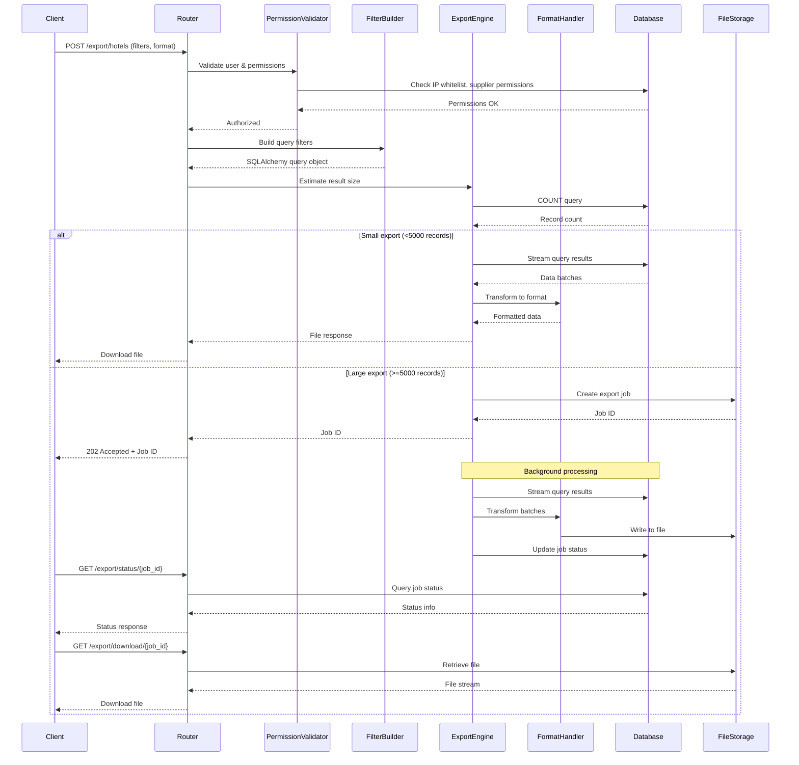

# Content Export Feature - Design Document

## Overview

The Content Export feature provides a comprehensive API endpoint system for exporting hotel data, provider mappings, and supplier statistics from the HITA platform. The feature supports multiple export formats (CSV, JSON, Excel), implements role-based access control, handles large datasets asynchronously, and maintains audit trails for compliance.

### Key Design Principles

1. **Performance First**: Stream-based processing for large datasets, database query optimization
2. **Security by Default**: Role-based permissions, IP whitelist validation, point deduction
3. **Format Flexibility**: Support CSV, JSON, and Excel with format-specific optimizations
4. **Scalability**: Asynchronous processing for large exports, pagination support
5. **Auditability**: Comprehensive logging of all export operations

## Architecture

### High-Level Architecture

```
┌─────────────────┐
│   API Client    │
└────────┬────────┘
         │
         ▼
┌─────────────────────────────────────────────────────┐
│           FastAPI Export Router                     │
│  ┌──────────────────────────────────────────────┐  │
│  │  POST /v1.0/export/hotels                    │  │
│  │  POST /v1.0/export/mappings                  │  │
│  │  POST /v1.0/export/supplier-summary          │  │
│  │  GET  /v1.0/export/status/{job_id}           │  │
│  │  GET  /v1.0/export/download/{job_id}         │  │
│  └──────────────────────────────────────────────┘  │
└────────┬────────────────────────────────────────────┘
         │
         ▼
┌─────────────────────────────────────────────────────┐
│         Export Service Layer                        │
│  ┌──────────────┐  ┌──────────────┐  ┌──────────┐  │
│  │  Permission  │  │   Filter     │  │  Format  │  │
│  │  Validator   │  │   Builder    │  │  Handler │  │
│  └──────────────┘  └──────────────┘  └──────────┘  │
└────────┬────────────────────────────────────────────┘
         │
         ▼
┌─────────────────────────────────────────────────────┐
│         Data Access Layer                           │
│  ┌──────────────┐  ┌──────────────┐  ┌──────────┐  │
│  │   Hotel      │  │   Mapping    │  │ Supplier │  │
│  │  Repository  │  │  Repository  │  │ Summary  │  │
│  └──────────────┘  └──────────────┘  └──────────┘  │
└────────┬────────────────────────────────────────────┘
         │
         ▼
┌─────────────────────────────────────────────────────┐
│              Database (MySQL/SQLite)                │
│  hotels | provider_mappings | supplier_summary      │
│  locations | contacts | user_provider_permissions   │
└─────────────────────────────────────────────────────┘
```

### Component Interaction Flow



## Components and Interfaces

### 1. Export Router (`routes/export.py`)

Main API endpoint handler for export operations.

**Endpoints:**

```python
# Synchronous/Asynchronous hotel data export
POST /v1.0/export/hotels
Request Body: ExportHotelsRequest
Response: FileResponse | ExportJobResponse

# Provider mapping export
POST /v1.0/export/mappings
Request Body: ExportMappingsRequest
Response: FileResponse | ExportJobResponse

# Supplier summary statistics export
POST /v1.0/export/supplier-summary
Request Body: ExportSupplierSummaryRequest
Response: FileResponse | ExportJobResponse

# Check export job status
GET /v1.0/export/status/{job_id}
Response: ExportJobStatusResponse

# Download completed export
GET /v1.0/export/download/{job_id}
Response: FileResponse
```

**Dependencies:**

- Authentication: `get_current_user` from `routes/auth.py`
- Database session: `get_db` from `database.py`
- Permission validation: `check_ip_whitelist` from `routes/contents.py`
- Point deduction: `deduct_points_for_general_user` from `utils.py`

### 2. Permission Validator (`services/export_permission_service.py`)

Validates user access to requested data based on role and supplier permissions.

**Interface:**

```python
class ExportPermissionService:
    def __init__(self, db: Session):
        self.db = db

    def validate_export_access(
        self,
        user: User,
        request: Request,
        requested_suppliers: List[str]
    ) -> PermissionValidationResult:
        """
        Validates user has permission to export data for requested suppliers.

        Returns:
            PermissionValidationResult with:
            - is_authorized: bool
            - allowed_suppliers: List[str]
            - denied_suppliers: List[str]
            - deactivated_suppliers: List[str]
        """
        pass

    def check_ip_whitelist(self, user_id: str, request: Request) -> bool:
        """Check if user's IP is whitelisted"""
        pass

    def get_user_suppliers(self, user_id: str) -> List[str]:
        """Get list of active suppliers for user"""
        pass
```

**Logic:**

- Super/Admin users: Access all suppliers except temporarily deactivated
- General users: Access only assigned suppliers, check for TEMP*DEACTIVATED* prefix
- IP whitelist validation for all users
- Point balance check for general users

### 3. Filter Builder (`services/export_filter_service.py`)

Constructs SQLAlchemy queries based on export filters.

**Interface:**

```python
class ExportFilterService:
    def build_hotel_query(
        self,
        db: Session,
        filters: HotelExportFilters,
        allowed_suppliers: List[str]
    ) -> Query:
        """Build optimized query for hotel export"""
        pass

    def build_mapping_query(
        self,
        db: Session,
        filters: MappingExportFilters,
        allowed_suppliers: List[str]
    ) -> Query:
        """Build query for provider mapping export"""
        pass

    def build_supplier_summary_query(
        self,
        db: Session,
        filters: SupplierSummaryFilters
    ) -> Query:
        """Build query for supplier summary export"""
        pass

    def estimate_result_count(self, query: Query) -> int:
        """Estimate number of results for query"""
        pass
```

**Supported Filters:**

- Supplier/provider names
- Country codes
- Rating range (min/max)
- Date range (created_at, updated_at)
- ITTID list
- City/state filters
- Property type

### 4. Export Engine (`services/export_engine.py`)

Core export processing engine with streaming and batch processing.

**Interface:**

```python
class ExportEngine:
    def __init__(self, db: Session):
        self.db = db
        self.batch_size = 1000
        self.async_threshold = 5000

    async def export_hotels(
        self,
        query: Query,
        format: ExportFormat,
        user: User
    ) -> Union[FileResponse, ExportJob]:
        """
        Export hotel data with automatic sync/async handling.

        - <5000 records: Synchronous streaming response
        - >=5000 records: Asynchronous background job
        """
        pass

    def stream_query_results(
        self,
        query: Query,
        batch_size: int = 1000
    ) -> Generator[List[Any], None, None]:
        """Stream query results in batches"""
        pass

    async def process_async_export(
        self,
        job_id: str,
        query: Query,
        format: ExportFormat
    ) -> None:
        """Background task for large exports"""
        pass
```

**Processing Strategy:**

- Batch size: 1000 records per iteration
- Memory management: Stream results, don't load all into memory
- Progress tracking: Update job status every 10% completion
- Error handling: Rollback on failure, log errors

### 5. Format Handler (`services/export_format_handler.py`)

Transforms data into specific export formats.

**Interface:**

```python
class ExportFormatHandler:
    def to_csv(
        self,
        data: Generator[List[Dict], None, None],
        output_path: str,
        headers: List[str]
    ) -> str:
        """Generate CSV file from data stream"""
        pass

    def to_json(
        self,
        data: Generator[List[Dict], None, None],
        output_path: str
    ) -> str:
        """Generate JSON file from data stream"""
        pass

    def to_excel(
        self,
        data: Dict[str, Generator[List[Dict], None, None]],
        output_path: str
    ) -> str:
        """Generate Excel file with multiple sheets"""
        pass

    def flatten_hotel_data(self, hotel: Hotel) -> Dict[str, Any]:
        """Flatten nested hotel structure for CSV"""
        pass
```

**Format Specifications:**

**CSV Format:**

- UTF-8 encoding with BOM
- Comma delimiter
- Double-quote text qualifier
- Flattened structure (one row per hotel)
- Headers: ittid, name, country_code, country_name, city_name, latitude, longitude, rating, address_line1, postal_code, provider_names, provider_ids, created_at, updated_at

**JSON Format:**

- UTF-8 encoding
- Pretty-printed with 2-space indentation
- Nested structure preserving relationships
- ISO 8601 datetime format
- Metadata header with export info

**Excel Format:**

- XLSX format (OpenXML)
- Multiple sheets: Hotels, Locations, Contacts, Mappings, Summary
- Formatted headers (bold, colored background)
- Auto-sized columns
- Freeze panes on header row
- Data validation where applicable

## Data Models

### Request Schemas

```python
class ExportFormat(str, Enum):
    CSV = "csv"
    JSON = "json"
    EXCEL = "excel"

class HotelExportFilters(BaseModel):
    suppliers: Optional[List[str]] = None
    country_codes: Optional[List[str]] = None
    min_rating: Optional[float] = None
    max_rating: Optional[float] = None
    date_from: Optional[datetime] = None
    date_to: Optional[datetime] = None
    ittids: Optional[List[str]] = None
    property_types: Optional[List[str]] = None
    page: int = 1
    page_size: int = 1000

class ExportHotelsRequest(BaseModel):
    filters: HotelExportFilters
    format: ExportFormat
    include_locations: bool = True
    include_contacts: bool = True
    include_mappings: bool = True

class MappingExportFilters(BaseModel):
    suppliers: Optional[List[str]] = None
    ittids: Optional[List[str]] = None
    date_from: Optional[datetime] = None
    date_to: Optional[datetime] = None

class ExportMappingsRequest(BaseModel):
    filters: MappingExportFilters
    format: ExportFormat

class SupplierSummaryFilters(BaseModel):
    suppliers: Optional[List[str]] = None
    include_country_breakdown: bool = False

class ExportSupplierSummaryRequest(BaseModel):
    filters: SupplierSummaryFilters
    format: ExportFormat
```

### Response Schemas

```python
class ExportJobResponse(BaseModel):
    job_id: str
    status: str  # "pending", "processing", "completed", "failed"
    estimated_records: int
    estimated_completion_time: str
    created_at: datetime
    message: str

class ExportJobStatusResponse(BaseModel):
    job_id: str
    status: str
    progress_percentage: int
    processed_records: int
    total_records: int
    created_at: datetime
    started_at: Optional[datetime]
    completed_at: Optional[datetime]
    error_message: Optional[str]
    download_url: Optional[str]
    expires_at: Optional[datetime]

class ExportMetadata(BaseModel):
    export_id: str
    generated_at: datetime
    generated_by: str
    user_id: str
    filters_applied: Dict[str, Any]
    total_records: int
    format: str
    version: str = "1.0"
```

### Database Models

```python
class ExportJob(Base):
    __tablename__ = "export_jobs"

    id = Column(String(50), primary_key=True)
    user_id = Column(String(10), ForeignKey("users.id"), nullable=False)
    export_type = Column(String(50), nullable=False)  # "hotels", "mappings", "supplier_summary"
    format = Column(String(10), nullable=False)
    filters = Column(JSON, nullable=True)
    status = Column(String(20), nullable=False, default="pending")
    progress_percentage = Column(Integer, default=0)
    processed_records = Column(Integer, default=0)
    total_records = Column(Integer, nullable=True)
    file_path = Column(String(500), nullable=True)
    file_size_bytes = Column(Integer, nullable=True)
    error_message = Column(Text, nullable=True)
    created_at = Column(DateTime, default=datetime.utcnow)
    started_at = Column(DateTime, nullable=True)
    completed_at = Column(DateTime, nullable=True)
    expires_at = Column(DateTime, nullable=True)

    # Relationships
    user = relationship("User", backref="export_jobs")
```

## Error Handling

### Error Response Format

```python
class ExportErrorResponse(BaseModel):
    error: bool = True
    message: str
    error_code: str
    details: Dict[str, Any]
    timestamp: datetime
```

### Error Codes

| Code                     | HTTP Status | Description                      |
| ------------------------ | ----------- | -------------------------------- |
| UNAUTHORIZED             | 401         | Invalid or expired token         |
| IP_NOT_WHITELISTED       | 403         | User IP not in whitelist         |
| INSUFFICIENT_PERMISSIONS | 403         | No access to requested suppliers |
| INSUFFICIENT_POINTS      | 402         | Not enough points for export     |
| INVALID_FORMAT           | 400         | Unsupported export format        |
| INVALID_FILTERS          | 400         | Invalid filter parameters        |
| EXPORT_TOO_LARGE         | 400         | Exceeds maximum export size      |
| JOB_NOT_FOUND            | 404         | Export job ID not found          |
| JOB_EXPIRED              | 410         | Export file has expired          |
| EXPORT_FAILED            | 500         | Internal export processing error |

### Error Handling Strategy

1. **Validation Errors**: Return 400 with specific field errors
2. **Permission Errors**: Return 403 with denied suppliers list
3. **Processing Errors**: Log full stack trace, return generic 500
4. **Async Job Errors**: Store in export_job.error_message, mark status as "failed"
5. **Database Errors**: Rollback transaction, log error, return 500

## Testing Strategy

### Unit Tests

**Test Coverage Areas:**

1. Permission validation logic
2. Filter query building
3. Data transformation (flatten, format)
4. CSV/JSON/Excel generation
5. Batch processing logic

**Test Files:**

- `tests/test_export_permission_service.py`
- `tests/test_export_filter_service.py`
- `tests/test_export_format_handler.py`
- `tests/test_export_engine.py`

### Integration Tests

**Test Scenarios:**

1. End-to-end hotel export (all formats)
2. Provider mapping export with filters
3. Supplier summary export
4. Async job creation and completion
5. Permission denial scenarios
6. Large dataset handling (>10k records)

**Test Files:**

- `tests/test_export_routes.py`
- `tests/test_export_async.py`

### Performance Tests

**Benchmarks:**

- 1,000 records: <5 seconds
- 10,000 records: <30 seconds
- 50,000 records: <3 minutes (async)
- Memory usage: <500MB for any export size

## Security Considerations

### Authentication & Authorization

1. **JWT Token Validation**: All endpoints require valid access token
2. **Role-Based Access**: Different permissions for SUPER_USER, ADMIN_USER, GENERAL_USER
3. **IP Whitelist**: Mandatory IP validation for all export requests
4. **Supplier Permissions**: Enforce user-supplier associations
5. **Point Deduction**: Deduct points for general users before processing

### Data Protection

1. **Sensitive Data**: Exclude internal IDs, audit fields from exports
2. **PII Handling**: Log exports containing user data for compliance
3. **File Security**: Store export files with restricted permissions
4. **Temporary Storage**: Auto-delete export files after 24 hours
5. **Rate Limiting**: Limit export requests per user (10 per hour)

### Audit Logging

Log all export operations with:

- User ID and role
- Export type and format
- Filters applied
- Record count
- File size
- IP address
- Timestamp
- Success/failure status

## Performance Optimization

### Database Optimization

1. **Indexes**: Ensure indexes on frequently filtered columns

   - `hotels.ittid`
   - `provider_mappings.provider_name`
   - `provider_mappings.ittid`
   - `locations.country_code`
   - `hotels.updated_at`

2. **Query Optimization**:

   - Use `joinedload` for eager loading relationships
   - Select only required columns
   - Use `yield_per()` for streaming large result sets
   - Implement query result caching for repeated exports

3. **Connection Pooling**:
   - Maintain pool of 5-10 connections
   - Use connection recycling (1 hour)
   - Enable pool pre-ping for connection validation

### Memory Management

1. **Streaming**: Process data in batches, never load entire dataset
2. **Generator Functions**: Use generators for data transformation
3. **File Writing**: Write to disk incrementally, not in-memory buffer
4. **Garbage Collection**: Explicitly delete large objects after processing

### Caching Strategy

1. **Supplier Summary**: Cache for 1 hour (frequently requested)
2. **User Permissions**: Cache for 5 minutes
3. **Export Metadata**: Cache job status for 30 seconds
4. **Filter Results**: Cache count queries for 1 minute

## Deployment Considerations

### Environment Variables

```bash
EXPORT_STORAGE_PATH=/var/hita/exports
EXPORT_MAX_SIZE=100000
EXPORT_ASYNC_THRESHOLD=5000
EXPORT_FILE_RETENTION_HOURS=24
EXPORT_RATE_LIMIT_PER_HOUR=10
```

### File Storage

- **Development**: Local filesystem (`./exports/`)
- **Production**: Network storage or S3-compatible object storage
- **Cleanup**: Scheduled job to delete expired exports (runs hourly)

### Background Processing

- **Task Queue**: Use FastAPI BackgroundTasks for async exports
- **Alternative**: Celery with Redis for distributed processing
- **Monitoring**: Track job queue length and processing times

### Monitoring & Alerts

**Metrics to Track:**

- Export request rate
- Average export duration
- Failed export percentage
- Storage usage
- Queue length (async jobs)

**Alerts:**

- Export failure rate >5%
- Average duration >2x baseline
- Storage usage >80%
- Queue length >50 jobs

## Future Enhancements

1. **Scheduled Exports**: Allow users to schedule recurring exports
2. **Email Delivery**: Send download link via email when export completes
3. **Incremental Exports**: Export only changes since last export
4. **Custom Templates**: User-defined column selection and ordering
5. **Compression**: ZIP large exports automatically
6. **API Webhooks**: Notify external systems when export completes
7. **Export History**: UI to view past exports and re-download
8. **Parquet Format**: Add Parquet format for big data analytics
